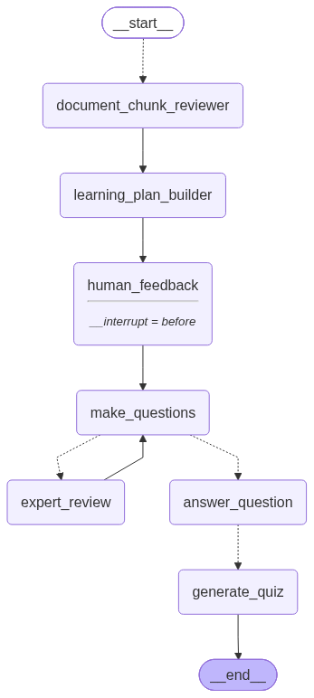

# Memorang

Turn any PDF into an interactive, AI-generated quiz. Upload a document, review
an AI-drafted learning plan (with a human-in-the-loop approval step), and get
a 10-question multiple-choice quiz grounded in the document's own content —
complete with hints, explanations, and a pass/fail summary.

# End-to-end Walkthough

AI learning application that takes a PDF, turns it into a structured learning plan, generates and reviews quiz questions, uses RAG to ground the answers in the original PDF, and then creates a multiple-choice quiz for the student.

## Step 1

The process starts when the user uploads a PDF through the frontend.
The PDF is sent to a FastAPI backend through the upload endpoint. The backend validates that it is actually a PDF, reads the file, and passes it to my PDF ingestion process.

The PDF is then split into smaller chunks. Each chunk also keeps metadata such as the page number to maintain a connection between the generated learning content and the original source.

From there, we start a new LangGraph execution using a unique thread ID. Using a LangGraph checkpointer so the state of that execution can be saved, which is important because this workflow includes a human-in-the-loop step.

## Step 2

The first major AI stage uses a map pattern.
Instead of sending the entire PDF to one LLM call, we send each document chunk to a document reviewer node.

Each chunk is reviewed independently, and the LLM extracts the main topic, key points, important facts, and a short summary.
Because these reviews can happen across multiple branches, we use a LangGraph reducer to combine all of the individual reviews into one list in the graph state.

Once all of those reviews are available, they move into the learning plan builder.

## Step 3

The learning plan builder looks across the reviews and produces two things.

First, it identifies the overall course topic. For example, if the PDF is about AI agent frameworks, the course topic might be "AI Agent Orchestration Frameworks."

Second, it creates a structured learning plan with exactly five sections. Those five sections become the foundation for the quiz.

## Step 4

At this point, we intentionally stop the graph for human review.
The learning plan is shown to the user before quiz generation begins. The user can approve it or provide feedback. Because the graph has a checkpointer and a thread ID, we can save the workflow at this point, update the graph state with the human feedback, and then continue the same execution.

## Step 5

Once approved, the graph moves into question generation.

The LLM generates exactly 10 quiz questions from the five-section learning plan.
Each question is represented as structured data. It contains the question itself and a topic field.
This topic is different from the overall course topic. Here, topic represents the exact learning-plan section that the question tests.

I'm keeping that metadata because later we can calculate how well the student performed in each of the five sections.

## Step 6

The questions then go through an evaluator-optimizer style loop.

An expert-review node receives the overall course topic, the learning plan, and the current questions. I prompt that model to behave as an expert in the course subject and look for missing concepts, repetition, unclear questions, or questions that could better test understanding.
That feedback goes back to the question-generation node.

We run this review process twice, so we end up with three versions of the questions: the original questions, an improved second version, and then the final third version.

## Step 7

Once the final questions are ready, we use another map pattern. Each question is sent independently to my answer-question node.

This is where RAG comes into the architecture.

The node searches the PDF content stored in Qdrant and retrieves source material relevant to the question. The LLM then has to answer using that retrieved context rather than relying only on its own knowledge.
For every question, we create a structured answer containing the question, the correct answer, an explanation, the supporting source pages, and the learning-plan topic that the question belongs to.

The topic doesn't need to be generated again here. I already know it from the original quiz question, so I simply carry that metadata forward.

## Step 8

Finally, each correct question and answer is sent to another node that generates three plausible incorrect answers.
That gives us everything required for a multiple-choice question: one correct answer, three wrong answers, an explanation, source information, and the section of the course being tested.

## Step 9

Those results are combined into the final 10-question quiz and returned to the frontend.
The student can then complete the quiz, see their overall result, and tips for imporving.

# Main architecture

PDF ingestion, parallel document review, learning-plan generation, human approval, quiz generation, expert evaluation and revision, RAG-grounded answer generation, multiple-choice generation, and finally student scoring and section-level performance.

## How it works under the hood

The backend is a [LangGraph](https://langchain-ai.github.io/langgraph/) agent
that pipelines a PDF through review, planning, question generation, expert
critique, and answer grounding before handing quizzes to the frontend. The
graph pauses (`__interrupt__`) after building the learning plan so a human can
approve or edit it before question generation continues.



1. **`document_chunk_reviewer`** — the PDF is chunked, and each chunk is sent
   (fanned out in parallel via `Send`) to the LLM to extract its main topic,
   key points, and facts.
2. **`learning_plan_builder`** — the chunk reviews are synthesized into a
   course topic and a structured 5-section learning plan.
3. **`human_feedback`** — the graph interrupts here. A human approves the
   learning plan as-is, or supplies feedback that's fed back into question
   generation.
4. **`make_questions` ⇄ `expert_review`** — 10 quiz questions are drafted from
   the learning plan, then critiqued by an "expert" LLM pass; the critique
   loops back to regenerate an improved question set (twice) before moving on.
5. **`answer_question`** — each question is answered using retrieval-augmented
   generation (RAG) over the document's embeddings in Qdrant, grounding the
   answer and explanation in the source pages.
6. **`generate_quiz`** — each grounded answer is turned into a multiple-choice
   question with 3 plausible wrong answers.

Once the quiz is generated, the frontend also calls `/api/hint` (RAG-grounded
hints that don't give away the answer) and `/api/summary` (a deterministic,
no-LLM pass/fail summary of the learner's first-attempt results).

## Tech stack

**Backend**
- [FastAPI](https://fastapi.tiangolo.com/) — HTTP API (`server.py`)
- [LangGraph](https://langchain-ai.github.io/langgraph/) + [LangChain](https://python.langchain.com/) — the quiz-generation agent (`quiz_agent.py`)
- [Qdrant](https://qdrant.tech/) — vector store for document chunk embeddings (`pdf_ingest.py`)
- [OpenAI](https://platform.openai.com/) — chat + embedding models

**Frontend** (`quiz-agent/`)
- [Next.js](https://nextjs.org/) 16 + React 19
- Tailwind CSS

## Project structure

```
.
├── server.py           # FastAPI app: HTTP endpoints
├── quiz_agent.py        # LangGraph agent: state, nodes, and graph wiring
├── pdf_ingest.py        # PDF → text → chunks → Qdrant embeddings
├── summary.py           # Deterministic scoring/summary logic
├── schemas.py            # Pydantic request/response models
├── config.py             # Centralized env var loading
├── quiz-agent/            # Next.js frontend
├── tests/
│   ├── unit/              # Fast, no external services
│   └── integration/        # Exercises the FastAPI endpoints
└── mermaid_diagram.png     # Agent graph diagram (rendered above)
```

## Getting started

### Prerequisites
- Python 3.11+ and [uv](https://docs.astral.sh/uv/)
- Node.js (for the frontend)
- An [OpenAI API key](https://platform.openai.com/api-keys)
- A [Qdrant](https://qdrant.tech/) instance (e.g. [Qdrant Cloud](https://cloud.qdrant.io/)) and API key
- A [Redis](https://redis.io/) instance with the RedisJSON and RediSearch modules
  (Redis 8+, Redis Stack, or [Redis Cloud](https://redis.io/cloud/)) for graph checkpointing

### Backend setup

1. Install dependencies:
   ```bash
   uv sync
   ```
2. Copy the env template and fill in your credentials:
   ```bash
   cp .env.example .env
   ```
   ```
   OPENAI_API_KEY=
   QDRANT_URL=
   QDRANT_API_KEY=
   REDIS_URL=
   ```
   `REDIS_URL` is a standard connection string, e.g. `redis://default:<password>@<host>:<port>`
   (use `rediss://` for TLS).
3. Run the API server:
   ```bash
   uv run python server.py
   ```
   The API is served at `http://127.0.0.1:8000`.

### Frontend setup

```bash
cd quiz-agent
npm install
npm run dev
```

The frontend expects the backend running at `http://127.0.0.1:8000` and is
itself served at `http://localhost:3000`.

## API endpoints

| Method | Path                        | Description                                              |
|--------|-----------------------------|------------------------------------------------------------|
| POST   | `/api/upload-pdf`           | Ingests a PDF, runs the graph up to the approval interrupt |
| POST   | `/api/resume/{thread_id}`   | Submits (or approves) feedback and resumes the graph to completion |
| POST   | `/api/hint`                 | Returns a RAG-grounded hint for a quiz question, without revealing the answer |
| POST   | `/api/summary`              | Computes a deterministic score/summary from quiz results |

## Notes

- Uploading a new PDF replaces the shared Qdrant collection (`pdf_documents`)
  — this is a single-document MVP, not per-session/multi-tenant.
- The quiz-generation graph checkpoints to Redis (`RedisSaver`, configured via
  `REDIS_URL`), so in-progress threads survive a server restart and can be
  resumed with the same `thread_id`. Checkpoints have no TTL yet, so old
  threads accumulate in Redis until removed.
- Redis is required at startup: `quiz_agent.py` creates its search indexes on
  import, so the server will not start without a reachable `REDIS_URL`.
